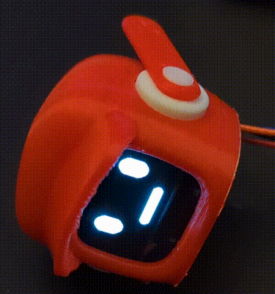

# Purpose
Insprired by K-VRC from Love, Death, & Robotics show, this small project recreates the character with printing, electronics, and programming.

# Prerequisites
* IDE: [VSCode + PlatformIO](https://platformio.org/install/ide?install=vscode)
    * If using Arduino IDE, just copy the main.cpp and manually install Adafruit OLED libraries (GFX + SSD1306)
* 3D Printer (small printers fine)
* [Arduino Nano](https://store-usa.arduino.cc/products/arduino-nano?selectedStore=us) (or any 5v Arduino-compatible board)
* 128 x 64 oled display (5v)
* Breadboard wires (most likely need to be male-female)

# Instructions
1. [Print K-VRC model with red filament](https://www.thingiverse.com/thing:3506189)
2. Connect breadboard wires to OLED (don't insert OLED into model yet)
3. Connect SCL from OLED to SCL on board (Pin A5 on Nano)
4. Connect SDA from OLED to SDA on board (Pin A4 on Nano)
5. Connect 5V and GND to the appropriate pins on board
6. IMPORTANT! [Change oled_addr to your OLED hex address (printed on the OLED itself)](https://github.com/moomurrs/K-VRC-Face/blob/3859a51ba25a666491731bdbe1e416e137945167/src/main.cpp#L15)
7. Flash the board with project code, verify blink works
8. Gently insert OLED into 3D printed model

DONE!